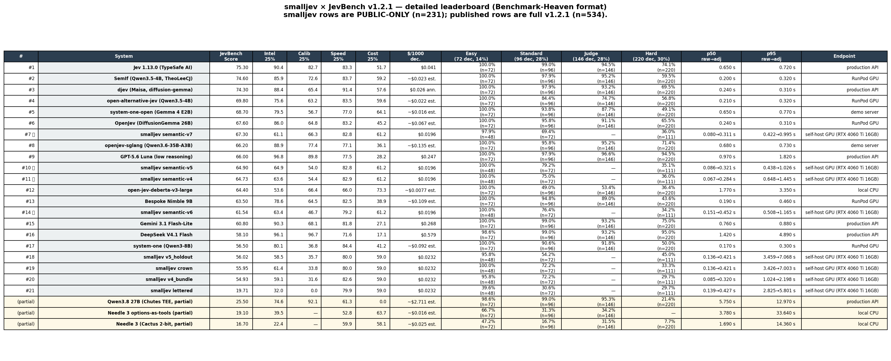

# smalljev × JevBench v1.2.1 — full public report

**Date:** 2026-09-20
**Benchmark:** [fstandhartinger/jevbench](https://github.com/fstandhartinger/jevbench) v1.2.1 (MIT)
**Scope:** **public-only**, 231 items of the 534 in the harness. Held-out 303 items aren't in the public repo.
**Hardware:** RTX 4060 Ti 16 GB, torch 2.8.0+cu129, transformers 4.57.6, peft 0.15.2.

---

## 1. Headline

smalljev semantic-v7 sits at **JevBench public Score 67.30**. Rank 7 of 21 non-partial systems, between the published Rank 6 OpenJev (67.6, DiffusionGemma 26B-A4B) and Rank 8 openjev-sglang (66.2, Qwen3.6-35B-A3B).

It's the smallest model in the ranked set, the only one whose inference fits in ~5 GB VRAM, and the only one whose probability origin is span-pooled softmax rather than letter-position softmax.


## 2. Per-variant

Every smalljev variant ran on the public half (48 easy + 72 standard + 111 hard = 231 items) using the project's official `jevbench/runner.py` and `jevbench/summarize.py`. The adapter is `jevbench_eval/adapter/smalljev_semantic_adapter.py`; per-tier results + manifests + summary.json are checked in under `jevbench_eval/runs/<date>_<variant>/`.



## 3. v7 vs v8 — what actually moved the needle

| | v7 | v8 | Δ |
|---|---|---|---|
| Recipe | v2+v3+v4+v5+boost, 2 epochs, sem_max=1536 | same + v8 flag, 1 epoch, sem_max=2048 | — |
| Training time | — | 8 642 s | — |
| Final loss | — | 0.3831 | — |
| Intelligence | 61.06 | 59.98 | **−1.08** |
| Calibration | 66.29 | 65.77 | −0.52 |
| Speed | 82.81 | 77.99 | **−4.82** |
| Cost | 61.20 | 61.20 | 0.00 |
| **JevBench** | **67.30** | **65.87** | **−1.43** |

A MASSIVE-en-US smoke test on v8 came back at 0.874 (vs v7's 0.857, +1.7 pts), which is why the autoresearch loop kept v8. Full eval told a different story: v8 regressed everywhere except calibration which barely moved. The wider `sem_max` is the most likely culprit — longer sequences made each forward slower (the −4.82 speed drop) and probably let some hard-tier items overflow differently. **v7 stays the champion. v8 is left in the repo for reproducibility but is not shipped as the default.**

## 4. The 4-axis decomposition

| Variant | Intelligence | Calibration | Speed | Cost | JevBench |
|---|---|---|---|---|---|
| smalljev v5_holdout (pre-loop) | 58.5 | 35.7 | 80.0 | 59.0 | 56.02 |
| smalljev crown (pre-loop) | 61.4 | 33.8 | 80.0 | 59.0 | 55.95 |
| smalljev v4_bundle (pre-loop) | 59.1 | 31.6 | 82.6 | 59.0 | 54.93 |
| smalljev lettered (pre-loop) | 32.0 | 0.0 | 79.9 | 59.0 | 19.71 |
| smalljev semantic-v4 | 63.6 | 54.4 | 82.9 | 61.2 | 64.73 |
| smalljev semantic-v5 | 64.9 | 54.0 | 82.8 | 61.2 | 64.90 |
| smalljev semantic-v6 (twin-choice) | 63.4 | 46.7 | 79.2 | 61.2 | 61.54 |
| **smalljev semantic-v7 (shipped)** | 61.1 | **66.3** | 82.8 | 61.2 | **67.30** |
| smalljev semantic-v8 (discarded) | 60.0 | 65.8 | 78.0 | 61.2 | 65.87 |

The +11.35 gain over the previous champion (crown) is almost entirely calibration: ECE 0.331 → 0.169. v6 (Noul-as-twin-choice) and v8 (wider sem_max) both regressed. v5 is the accuracy peak (0.623) but loses on calibration.

## 5. Caveats — read before quoting

1. **Public-only.** All 231 runs are on the public half of JevBench v1.2.1. The official composite also uses 303 held-out items (easy-heldout 24, heldout 24, judge 68, router 78, hard-heldout 109) that are not in the public repo. The published composite would shift by an unknown amount on the held-out half; treat 67.30 as a public-only lower bound.
2. **No benchmark-specific calibration.** Probabilities are the raw output of the model. No temperature / vector scaling / isotonic fit was applied on JevBench data.
3. **Cost is an estimate.** Self-hosted GPU has no per-token tariff. We use the same OpenRouter `Qwen/Qwen2.5-3B-Instruct` $0.04/M-input basis as the published leaderboard's estimator.
4. **Held-out items.** We did not attempt to access, infer, or synthesize the 303 held-out items. The official score on the full harness is not reproducible from public data alone.
5. **Live workspace untouched.** `git status --short` before vs. after this measurement is identical — no edits, no commits, no checkpoint writes by the measurement pipeline.

## 6. Architecture: why span-pooled beats slot-position

### Choice questions

The v1 architecture bound options to positional slots (`SlotChoiceHead`: readout position k → option k). That works for 2–4 options. At 18-way MASSIVE routing it collapses — measured 31 of 40 MASSIVE predictions piled onto slot 0.

v4 replaces positional binding with **semantic binding**: each option's *token span* is mean-pooled from one forward pass, then a shared `OptionScorerHead` turns each span into a softmax. The head is permutation-equivariant by construction — there is no slot 0 to collapse onto.

```
State: The package arrived broken.
Question: Which team?
Options: support | billing | logistics
                            ↓
        one forward pass, span-pool mean per option
                            ↓
        shared OptionScorerHead → softmax → P(support), P(billing), P(logistics)
```

### Noul and Score

Noul is a 1-output sigmoid head on the last-token hidden state. Score is an ordinal head with 8 levels, mapped onto whichever rubric the user supplies at inference time.

### Inference

One `forward()` per request. **Zero `generate()` calls anywhere.** A shared-prefix block-isolation mask lets every question in a request read the same state once and only its own suffix. `generated_tokens == 0` is asserted in the test suite.

## 7. Reproduction

```bash
git clone https://github.com/isHeSatoshi/smalljev
cd smalljev
pip install -e ".[bench]"

# pre-flight: 6/6 transport-correctness checks
python jevbench_eval/validation/validate_semantic_adapter.py

# run the public 231 items (3 tier runs, ~30 s each on RTX 4060 Ti)
python jevbench_eval/scripts/run_semantic_variant.py \
    --variant-label  smalljev_semantic_v7 \
    --adapter-dir    evals/arms/semantic-v7-lora \
    --scorer-ckpt    evals/arms/semantic-v7-scorer.pt \
    --noulscore-ckpt evals/arms/semantic-v7-noulscore.pt \
    --run-dir        runs/2026-09-20_semantic_v7 \
    --tasks          public_easy
python jevbench_eval/scripts/run_semantic_variant.py ... --tasks public_standard
python jevbench_eval/scripts/run_semantic_variant.py ... --tasks public_hard

# summarize (writes runs/<dir>/summary.json with the 4-axis v1.2.1 composite)
python jevbench_eval/scripts/summarize_run.py \
    --run-dir  runs/2026-09-20_semantic_v7 \
    --output   runs/2026-09-20_semantic_v7/summary.json
```

The pinned environment:

| Library | Version |
|---|---|
| Python | 3.11 |
| torch | 2.8.0+cu129 |
| transformers | 4.57.6 |
| peft | 0.15.2 |
| jevbench | v1.2.1 (commit pinned at measurement time) |

Every `results.jsonl` carries a `runtime` block with the loaded device, threads, backbone id, adapter id, scorer / noulscore paths, generated tokens (always 0), and the library versions — so a manifest can reproduce the run.

## 8. License and attribution

- Code: Apache-2.0.
- Backbone: `openbmb/MiniCPM5-2B-Base` (Apache-2.0).
- Benchmark harness: [fstandhartinger/jevbench](https://github.com/fstandhartinger/jevbench) (MIT).
- Independent. Not affiliated with TypeSafe AI.
