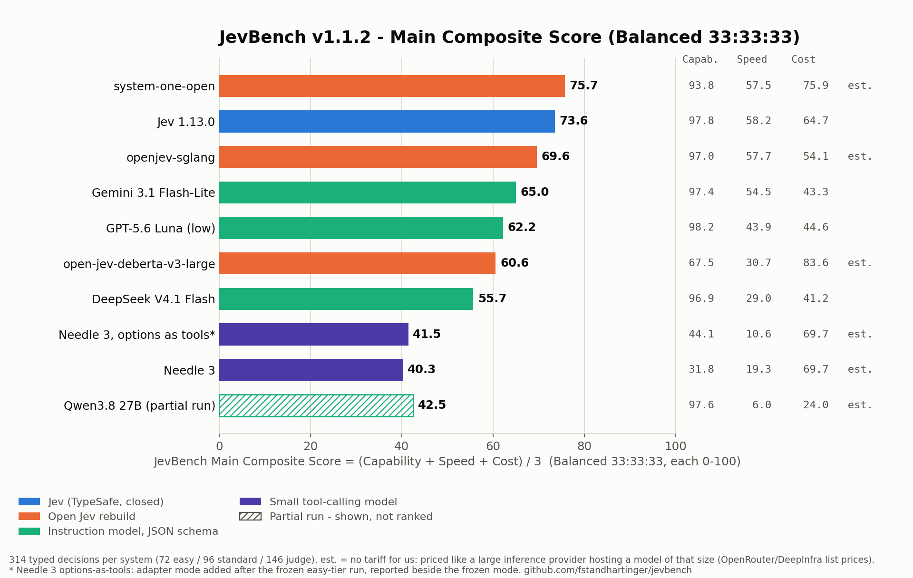
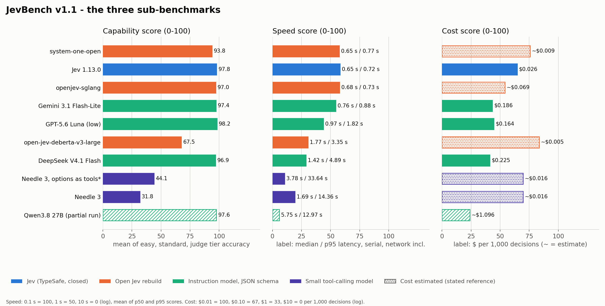
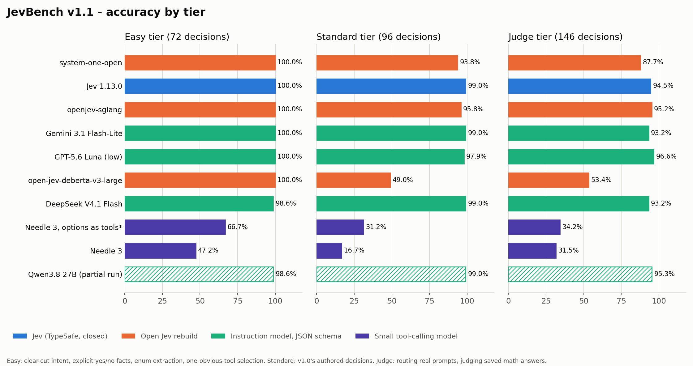
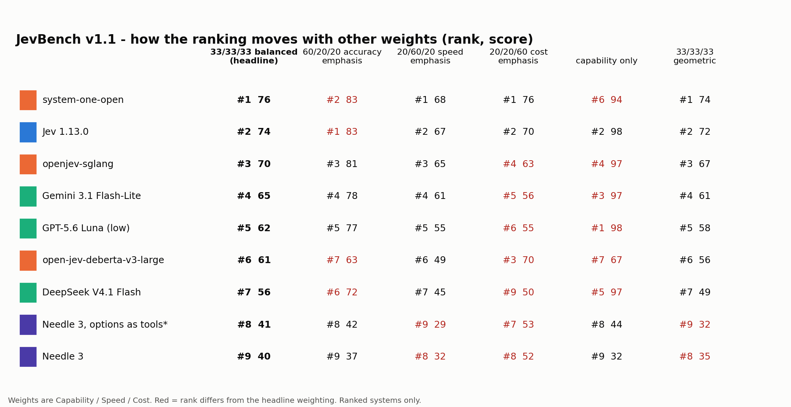

> [!WARNING]
> Superseded by **JevBench v1.2** — see [`RESULTS-v1.2.md`](RESULTS-v1.2.md). These results stay as published for their version.

# JevBench v1.1 - results

Generated from `results/v1.1/jevbench-v1.1-results.json` (2026-09-19T09:19 UTC). v1.1 is a new version: it adds an easy tier and scores three sub-benchmarks. Its numbers are not comparable with v1.0's single pooled accuracy ([`RESULTS.md`](RESULTS.md)), which stays as published.

**Revision v1.1.2.** 19 Sep 2026 (v1.1.2): the Main Score is now Balanced 33:33:33 (Capability, Speed and Cost weighted equally); the old 60:20:20 default is kept as the preset 'Emphasis on Accuracy'. The Cost scale is widened to $0.001-$10 per 1,000 decisions so it no longer saturates. Earlier the same day (v1.1.1): the Cost sub-benchmark was re-priced. Systems without a tariff are now priced as if a large inference provider hosted them (OpenRouter/DeepInfra list prices for the same weights or the model's size class) instead of our own CPU time or the nearest larger model family; Main Scores and ranks are recomputed. Items, answers, Capability and Speed are unchanged. The v1.1 numbers stay at tag v1.1, v1.1.1 at tag v1.1.1.

## Main Score

**JevBench Main Composite Score - Balanced 33:33:33 = (Capability + Speed + Cost) / 3**, each sub-score on 0-100 (since v1.1.2, 19 Sep 2026). The previous default, 0.6 x Capability + 0.2 x Speed + 0.2 x Cost, is kept as the named weighting *Emphasis on Accuracy (60:20:20)*; *Emphasis on Speed (20:60:20)* and *Emphasis on Cost (20:20:60)* are the other presets. How the ranking moves under each is in the sensitivity table below, and benchmarkheaven.com/jev-models lets you set your own weights.

| # | System | Main | Capability | Speed | Cost | Easy | Standard | Judge | p50 / p95 | $ per 1,000 |
|---|---|---|---|---|---|---|---|---|---|---|
| 1 | system-one-open (Gemma 4 E2B LoRA on an L4) | **75.7** | 93.8 | 57.5 | 75.9 | 100.0 % | 93.8 % | 87.7 % | 0.65 s / 0.77 s | ~$0.0092 |
| 2 | Jev 1.13.0 (TypeSafe AI) | **73.6** | 97.8 | 58.2 | 64.7 | 100.0 % | 99.0 % | 94.5 % | 0.65 s / 0.72 s | $0.0259 |
| 3 | openjev-sglang (Qwen3.6-35B-A3B on SGLang) | **69.6** | 97.0 | 57.7 | 54.1 | 100.0 % | 95.8 % | 95.2 % | 0.68 s / 0.73 s | ~$0.0685 |
| 4 | Gemini 3.1 Flash-Lite | **65.0** | 97.4 | 54.5 | 43.3 | 100.0 % | 99.0 % | 93.2 % | 0.76 s / 0.88 s | $0.1856 |
| 5 | GPT-5.6 Luna (low reasoning effort) | **62.2** | 98.2 | 43.9 | 44.6 | 100.0 % | 97.9 % | 96.6 % | 0.97 s / 1.82 s | $0.1642 |
| 6 | open-jev-deberta-v3-large (local CPU) | **60.6** | 67.5 | 30.7 | 83.6 | 100.0 % | 49.0 % | 53.4 % | 1.77 s / 3.35 s | ~$0.0045 |
| 7 | DeepSeek V4.1 Flash (thinking default) | **55.7** | 96.9 | 29.0 | 41.2 | 98.6 % | 99.0 % | 93.2 % | 1.42 s / 4.89 s | $0.2252 |
| 8 | Needle 3, options as tools (post-hoc adapter mode) | **41.5** | 44.1 | 10.6 | 69.7 | 66.7 % | 31.2 % | 34.2 % | 3.78 s / 33.64 s | ~$0.0162 |
| 9 | Needle 3 (Cactus, 2-bit, local CPU) | **40.3** | 31.8 | 19.3 | 69.7 | 47.2 % | 16.7 % | 31.5 % | 1.69 s / 14.36 s | ~$0.0162 |

`~` = an estimate from a stated reference deployment, because we pay no tariff on that route (see Cost below). Every other price is the provider's public tariff times the tokens we measured.

**Shown, not ranked** (a tier was not attempted in full):

| System | Main | Easy | Standard | Judge | Coverage (easy / standard / judge) | Why |
|---|---|---|---|---|---|---|
| Qwen3.8 27B (Chutes TEE) | 42.5 | 98.6 % | 99.0 % | 95.3 % | 100 % / 100 % / 87 % | v1.0 run stopped at 223 of 242 after three empty completions in a row |
| open-alternative-jev (Qwen3.5-4B, HF Space) | - | - | 33.3 % | - | 0 % / 6 % / 0 % | the author's free Hugging Face Space ran out of ZeroGPU quota after 6 decisions in v1.0, and answered the first v1.1 request on 19 Sep with the same quota error; the next step is a paid Hugging Face subscription, which we did not buy |

## The three sub-benchmarks

- **Capability.** Mean of the three tier accuracies (easy, standard, judge), each weighted 1/3, times 100. Frozen with the v1.1 dataset before any v1.1 inference. Pooled accuracy over all 314 decisions is published beside it.
- **Calibration.** Reported, not scored. Brier and ECE are published for every system that returns a distribution. They are not part of Capability or the Main Score, because label-only systems (Needle 3) have no distribution and any penalty we invented for that would be our choice, not a measurement; and verbalised LLM probabilities and native model distributions are different things.
- **Speed.** Median (p50) and 95th-percentile latency of successful requests in the system's serial run of the 242 standard+judge decisions (one request at a time, from a Hetzner server in Germany, network included; local models on 2 CPU threads of a Ryzen 5 3600). Each latency t maps to 100 * (log10(10 s) - log10(t)) / 2, clipped to 0..100: 0.1 s = 100, 1 s = 50, 10 s = 0. Speed = mean of the p50 and p95 scores. Log scale because 0.2 s vs 0.4 s matters as much as 2 s vs 4 s.
- **Cost.** Dollars per 1,000 decisions over all attempted decisions. Metered APIs: the provider's public tariff times measured tokens. No tariff for us (open weights, author demos, local runs): an ESTIMATE, labelled as such, priced as if a large inference provider hosted the model - the OpenRouter list price of the same weights (else the nearest larger sibling; else the DeepInfra list price of the same weights or of the nearest larger model of the same size class, e.g. same-size encoders for an encoder) times the tokens per decision (measured, or the input tokens of the gemini-3.1-flash-lite run on the same prompts). Not GPU rental by the minute and not our own CPU time: providers buy capacity in bulk or own the hardware. Each cost c maps to 100 * (log10($10) - log10(c)) / 4, clipped to 0..100: $0.001 per 1,000 = 100, $0.01 = 75, $0.10 = 50, $1 = 25, $10 = 0. Log scale over four decades, so every benchmarked system lands inside the scale and real price differences (e.g. an encoder vs a tiny generator) show up as different scores.
- **Main.** JevBench Main Composite Score = (Capability + Speed + Cost) / 3, 'Balanced 33:33:33'. Since v1.1.2 (19 Sep 2026); v1.1 and v1.1.1 used 0.6 * Capability + 0.2 * Speed + 0.2 * Cost, which is kept as the named weighting 'Emphasis on Accuracy (60:20:20)'. The sensitivity table shows the ranking under five other weightings.
- **Ranked.** Ranked: every tier attempted in full or nearly (>= 95% of decisions). Partial runs are shown, marked, and not ranked.

### Capability by tier

| Tier | Decisions | What it is |
|---|---|---|
| easy | 72 | 72 clear-cut decisions (intent, explicit yes/no fact, enum extraction, one-obvious-tool selection); new in v1.1 |
| judge | 146 | 146 imported decisions from v1.0 (routing real task prompts into 9 categories; judging whether a saved math answer is correct), unchanged |
| standard | 96 | 96 authored decisions from v1.0 (policy, intent, extraction, ordinal, adequacy, routing), unchanged |

The easy tier exists so that the floor of the scale means something. In v1.0 a small tool-calling model scored nothing on the hard routing tasks, and a flat zero would have ranked it level with a system that answers nothing at all. The easy tier asks what small function-calling and extraction models are built for: a clear-cut intent with obvious labels, a yes/no fact stated in the text, an enum named in a short message, the one obviously right tool. Every capable system scores at or near 100 % there; that is the point - the tier separates the bottom of the field, not the top. It was written, reviewed and frozen (hashes in `datasets/manifest.json`) before any v1.1 inference; 48 items are public in `datasets/public/easy.jsonl`, 24 are held out.

### Cost for systems with no tariff

We never write a zero for a route we did not pay for, and we never leave it blank without saying why. The rule:

- **system-one-open (Gemma 4 E2B LoRA on an L4)**: ESTIMATE: hosted-provider price, deepinfra google/gemma-4-E4B-it list price $0.02/M in, $0.1/M out (Gemma 4 E2B is not listed; the nearest larger sibling, Gemma 4 E4B, is listed only on DeepInfra) x 452 input and 2 output tokens per decision (input tokens counted from the gemini-3.1-flash-lite run, same prompts).
- **openjev-sglang (Qwen3.6-35B-A3B on SGLang)**: ESTIMATE: hosted-provider price, openrouter qwen/qwen3.6-35b-a3b list price $0.1/M in, $0.9/M out (same base weights) x 667 input and 2 output tokens per decision.
- **open-jev-deberta-v3-large (local CPU)**: ESTIMATE: hosted-provider price, deepinfra encoders of the same size (bge-large, e5-large, Qwen3-Embedding-0.6B) list price $0.01/M in, $0.0/M out (an encoder of the same size class; one forward pass, nothing generated) x 452 input and 0 output tokens per decision (input tokens counted from the gemini-3.1-flash-lite run, same prompts).
- **Needle 3, options as tools (post-hoc adapter mode)**: ESTIMATE: hosted-provider price, openrouter meta-llama/llama-3.2-1b-instruct list price $0.027/M in, $0.201/M out (as needle-3) x 452 input and 20 output tokens per decision (input tokens counted from the gemini-3.1-flash-lite run, same prompts).
- **Needle 3 (Cactus, 2-bit, local CPU)**: ESTIMATE: hosted-provider price, openrouter meta-llama/llama-3.2-1b-instruct list price $0.027/M in, $0.201/M out (no generative model under 1B is listed; the smallest listed one (1B) errs high; about 20 generated tokens for one tool call) x 452 input and 20 output tokens per decision (input tokens counted from the gemini-3.1-flash-lite run, same prompts).
- **Qwen3.8 27B (Chutes TEE)**: ESTIMATE: hosted-provider price, openrouter qwen/qwen3.8-27b list price $0.214/M in, $2.55/M out (same weights; our run used a flat-rate Chutes subscription) x 445 input and 393 output tokens per decision.
- **open-alternative-jev (Qwen3.5-4B, HF Space)**: ESTIMATE: hosted-provider price, deepinfra Qwen/Qwen3.5-4B list price $0.03/M in, $0.15/M out (same weights (not on OpenRouter); one forward pass, nothing generated) x 452 input and 1 output tokens per decision (input tokens counted from the gemini-3.1-flash-lite run, same prompts).

How costs are estimated: A system with a public per-call or per-token tariff is priced at that tariff x measured tokens. A system without one (open weights, author demos, local CPU runs) is priced as if a large inference provider hosted it: the OpenRouter list price of the same weights; if OpenRouter does not list them, the nearest LARGER sibling on OpenRouter; if no sibling of the size class is on OpenRouter, the DeepInfra list price of the same weights or the nearest larger model of the same class. Never RunPod/per-minute GPU rental and never our own CPU time: providers buy capacity in bulk or own the GPUs. Price x tokens per decision (measured where the run reports usage, else the input tokens of the gemini-3.1-flash-lite run on the same prompts, which is how the other systems see the same state and rubric) = $ per 1,000 decisions, marked est. Reference prices: OpenRouter https://openrouter.ai/api/v1/models and DeepInfra https://api.deepinfra.com/models/list (both read 2026-09-19). Size-class reference models: dense_2-4B: deepinfra Qwen/Qwen3.5-4B 0.03/0.15, deepinfra google/gemma-4-E4B-it 0.02/0.1, openrouter google/gemma-3-4b-it 0.05/0.1, openrouter meta-llama/llama-3.2-3b-instruct 0.05/0.33; dense_27B: openrouter qwen/qwen3.5-27b 0.195/1.56, openrouter qwen/qwen3.6-27b 0.3/2.0, openrouter qwen/qwen3.8-27b 0.214/2.55; dense_9B: openrouter qwen/qwen3.5-9b 0.1/0.15; encoder_classifier_<=0.6B: BAAI/bge-large-en-v1.5 (335M) 0.01, Qwen/Qwen3-Embedding-0.6B 0.01, intfloat/e5-large-v2 (335M) 0.01, intfloat/multilingual-e5-large (560M) 0.01, thenlper/gte-base (110M) 0.005; generative_<=1B: deepinfra meta-llama/Llama-3.2-1B-Instruct 0.005/0.01, openrouter meta-llama/llama-3.2-1b-instruct 0.027/0.201; moe_26B-A4B: deepinfra google/gemma-4-26B-A4B-it 0.07/0.34, openrouter google/gemma-4-26b-a4b-it 0.09/0.3; moe_35B-A3B: deepinfra Qwen/Qwen3.6-35B-A3B 0.1/0.95, openrouter qwen/qwen3.5-35b-a3b 0.1625/1.3, openrouter qwen/qwen3.6-35b-a3b 0.1/0.9 ($ per million input/output tokens).

### Calibration (reported, not scored)

| System | Brier (standard + judge) | Distribution |
|---|---|---|
| system-one-open (Gemma 4 E2B LoRA on an L4) | 0.138 | native |
| Jev 1.13.0 (TypeSafe AI) | 0.056 | native |
| openjev-sglang (Qwen3.6-35B-A3B on SGLang) | 0.085 | native |
| Gemini 3.1 Flash-Lite | 0.095 | verbalized |
| GPT-5.6 Luna (low reasoning effort) | 0.056 | verbalized |
| open-jev-deberta-v3-large (local CPU) | 0.651 | native |
| DeepSeek V4.1 Flash (thinking default) | 0.028 | verbalized |
| Needle 3, options as tools (post-hoc adapter mode) | - | label_only_no_calibrated_distribution |
| Needle 3 (Cactus, 2-bit, local CPU) | - | label_only_no_calibrated_distribution |
| Qwen3.8 27B (Chutes TEE) | 0.019 | verbalized |
| open-alternative-jev (Qwen3.5-4B, HF Space) | 1.001 | native |

## Sensitivity: the ranking under other weights

| System | 33/33/33 balanced (headline) | 60/20/20 accuracy emphasis | 20/60/20 speed emphasis | 20/20/60 cost emphasis | capability only | 33/33/33 geometric |
|---|---|---|---|---|---|---|
| system-one-open (Gemma 4 E2B LoRA on an L4) | #1 (75.7) | #2 (82.9) | #1 (68.4) | #1 (75.8) | #6 (93.8) | #1 (74.2) |
| Jev 1.13.0 (TypeSafe AI) | #2 (73.6) | #1 (83.3) | #2 (67.4) | #2 (70.0) | #2 (97.8) | #2 (71.7) |
| openjev-sglang (Qwen3.6-35B-A3B on SGLang) | #3 (69.6) | #3 (80.6) | #3 (64.8) | #4 (63.4) | #4 (97.0) | #3 (67.2) |
| Gemini 3.1 Flash-Lite | #4 (65.0) | #4 (78.0) | #4 (60.8) | #5 (56.3) | #3 (97.4) | #4 (61.2) |
| GPT-5.6 Luna (low reasoning effort) | #5 (62.2) | #5 (76.6) | #5 (54.9) | #6 (55.2) | #1 (98.2) | #5 (57.7) |
| open-jev-deberta-v3-large (local CPU) | #6 (60.6) | #7 (63.3) | #6 (48.6) | #3 (69.8) | #7 (67.5) | #6 (55.7) |
| DeepSeek V4.1 Flash (thinking default) | #7 (55.7) | #6 (72.2) | #7 (45.0) | #9 (49.9) | #5 (96.9) | #7 (48.7) |
| Needle 3, options as tools (post-hoc adapter mode) | #8 (41.5) | #8 (42.5) | #9 (29.1) | #7 (52.8) | #8 (44.1) | #9 (31.9) |
| Needle 3 (Cactus, 2-bit, local CPU) | #9 (40.3) | #9 (36.9) | #8 (31.9) | #8 (52.1) | #9 (31.8) | #8 (35.0) |

Under the headline weights system-one-open (Gemma 4 E2B LoRA on an L4) leads Jev 1.13.0 (TypeSafe AI) by 2.2 points. First place by weighting: *33/33/33 balanced (headline)*: system-one-open (Gemma 4 E2B LoRA on an L4); *60/20/20 accuracy emphasis*: Jev 1.13.0 (TypeSafe AI); *20/60/20 speed emphasis*: system-one-open (Gemma 4 E2B LoRA on an L4); *20/20/60 cost emphasis*: system-one-open (Gemma 4 E2B LoRA on an L4); *capability only*: GPT-5.6 Luna (low reasoning effort); *33/33/33 geometric*: system-one-open (Gemma 4 E2B LoRA on an L4).

## Needle 3

Needle 3 (Cactus Compute, 121M parameters, 2-bit, local CPU) is a function-calling model, not a Jev-class decision model: it returns a tool call (a label), not a probability distribution over the label set, so it has no Brier or ECE and we do not manufacture one from its single confidence scalar. The adapter asks it the way it is built to be asked: one tool whose one argument is the typed answer - an enum for choices, a boolean for yes/no, an integer enum for levels. When Needle declines to call the tool (its "the request does not fit the tool" refusal), the decision counts as wrong; what the suppressed call would have said is kept in the raw record.

After the frozen easy-tier run showed Needle declining the one-tool form for requests like "Where is my package?" (no tool could *serve* the request), we added a second adapter mode: every option becomes its own tool, and the tool it calls is the answer - Needle's native tool-selection use. It is reported **beside** the frozen mode, never instead of it, and marked with an asterisk wherever it appears. Judge-tier items are all yes/no, which this mode does not change, so they are shared with the frozen run rather than re-run. For about four minutes of this mode's 174-decision run our own video rendering shared the server's CPU, so its latency (and with it its Speed score) may be slightly pessimistic; the frozen-mode run had the CPU to itself.

## Reproduce

`jevbench/composite.py` holds the scoring rules as pure functions (tested in `tests/test_composite.py`); the artifact carries every input they need, so any Main Score in this file can be recomputed from the JSON.

